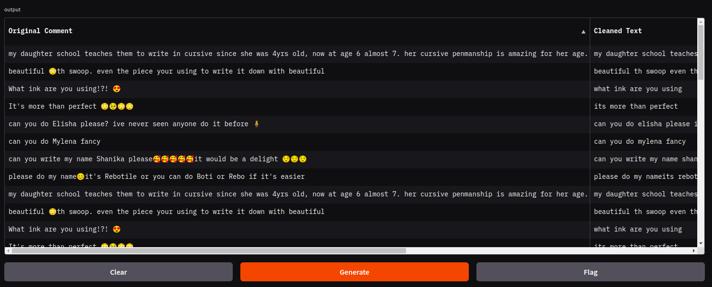

# RealTime Sentiment Analysis with Apache Kafka, SparkStreaming

  

## Screenshots  

## Tech Stack  

**Client:** Gradio 

**Server:** Apache Kafka, Apache Spark, Docker

## Run Locally  
Clone the project  

~~~bash  
  git clone https://github.com/chirikatori/realtime-sentiment-analysis.git
~~~

Go to the project directory  

~~~bash  
  cd realtime-sentiment-analysis
~~~

Install dependencies  

~~~bash  
conda env create -f environment.yml
~~~

~~~bash
sudo docker compose up -d
~~~

~~~bash  
pyspark --packages org.apache.spark:spark-sql-kafka-0-10_2.12:3.5.0
~~~

Run project
~~~bash
conda activate wsentiment
~~~

~~~bash
spark-submit --packages org.apache.spark:spark-streaming-kafka-0-10_2.12:3.5.3,org.apache.spark:spark-sql-kafka-0-10_2.12:3.5.3 --conf spark.pyspark.python=$(which python) main.py
~~~

After that, go to [localhost:7860](localhost:7860)

## Environment Variables  

To run this project, you will need to fill Variables in [data_streaming/config.py](data_streaming/config.py)

## Acknowledgements  

## Feedback  

If you have any feedback, please reach out to us at thanhluffy5D@gmail.com

## License  

[MIT](https://choosealicense.com/licenses/mit/)
